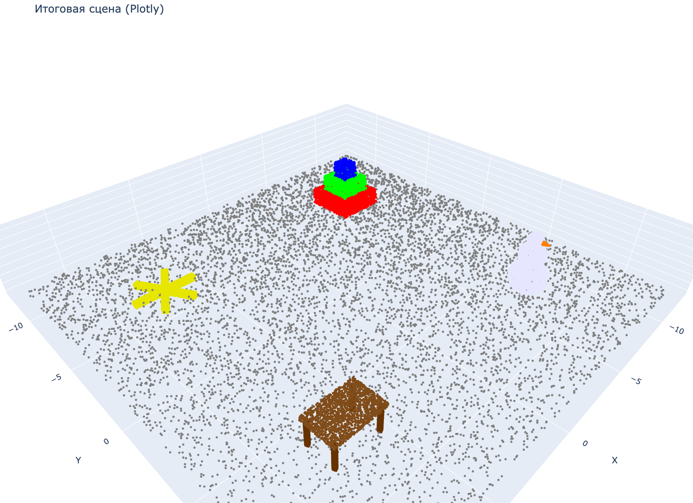

# Task 2 — Трёхмерные модели: облака точек в Open3D

Домашнее задание №1 курса «Трёхмерные модели»: построение сложной сцены из облаков точек.

## Содержание

- `Task_2.ipynb` — решение задания.
- `results/results.png` — итоговая сцена (Plotly).

## Что сделано

1. **Примитивы** — куб, сфера, цилиндр, конус, тор; облака точек через `sample_points_uniformly`
   и `sample_points_poisson_disk`.
2. **Трансформации** — перенос, масштаб, поворот (`translate`, `scale`, `rotate`).
3. **Композиции** — снеговик, стол, пирамида из кубов, шестилучевая звезда.
4. **Визуализация** — итоговая сцена в Open3D и Plotly.
5. **Раскраска** — объекты разными цветами (`paint_uniform_color`).

## Запуск

```bash
pip install open3d numpy plotly kaleido
jupyter notebook Task_2.ipynb
```

> В ноутбуке используется `o3d.visualization.draw_geometries(...)` — он открывает
> интерактивное окно Open3D. Итоговая сцена дополнительно сохраняется в `results/results.png`.

## Результат


